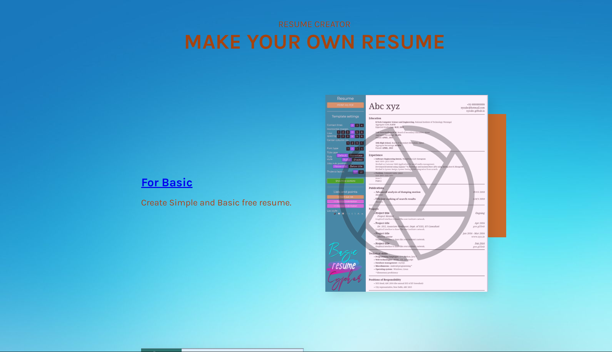

# Resume Builder

Welcome to the Resume Builder project! This web application allows users to create customized resumes using modern templates. Users can select the number of sections, customize bullet points, adjust line height, font size, and more. The final resume can be downloaded in PDF format, and there's no need for users to sign in to access these features.

## Demo

You can try out the Resume Builder by visiting the [project website](https://ansh2822.github.io/Resume-creator.github.io/).

## Features

- **Modern Templates**: Choose from a selection of contemporary resume templates.
- **Customization**: Customize your resume by selecting the number of sections and adjusting formatting options such as bullet points, line height, and font size.
- **PDF Download**: Download your customized resume in PDF format for easy sharing and printing.
- **No Sign-In Required**: Enjoy the convenience of using the application without the need to create an account.

## Usage

1. Visit the [Resume Builder website](https://ansh2822.github.io/Resume-creator.github.io/).
2. Select a template that suits your preferences.
3. Customize the resume by adding or removing sections and adjusting formatting options.
4. Preview your resume and make any necessary changes.
5. Once satisfied, click the "Download PDF" button to save your resume in PDF format.

## Installation

You can host the Resume Builder on your own server by following these steps:

1. Clone the repository:
   `git clone https://github.com/ansh2822/Resume-creator.github.io.git`
2.Navigate to the project directory:
`cd Resume-creator.github.io`
3.Open the index.html file in your web browser.

